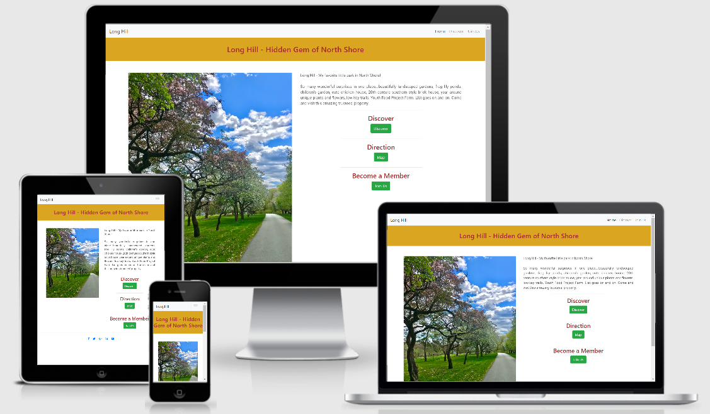
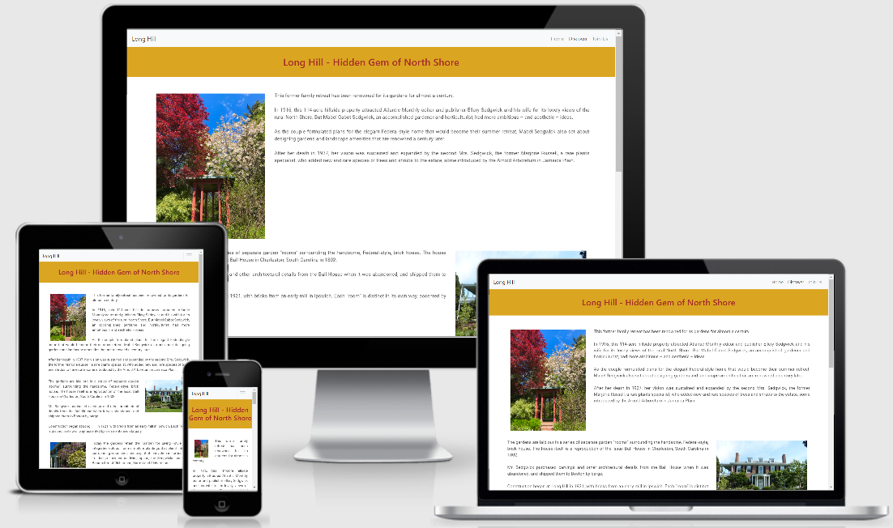
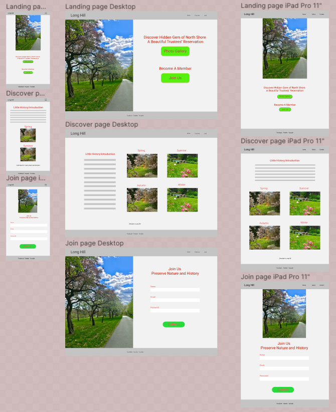

## User Centric Frontend Development Milestone Project 1 -- Long Hill

Long Hill is my favorite place at North Shore. It's a beautiful estate managed by the Trustees of Reservations. I hope this website will let users discover this hidden gem in North Shore and come visit, enjoy the beauty, become a member and support the Trustees.

My Long Hill website can be accessed [here](https://suping106.github.io/milestone1/)

## UX

### As a user
- I can read about the history of this property.
- I can see the photos in different seasons.
- I can find directions to the estate.
- I can sign up to be a member.
- I can navigate through pages.
- I can browse Trustees social media sites.

### As a website owner
- I want people to know and visit this beautiful place.
- I want to share the photos I took over the years.
- I hope people would like to become a member and support the trustees.

### Responsive design
User can browse this website on different devices.

## Wireframes

I used Figma to creat the wireframes for the original design of the project. During the development phase some modifications and improvements were made to the project when I moved along. 

Link to my original wireframes is [here](https://www.figma.com/file/2a5UR6GjIVR26Z2MoWQAEx/LongHill?node-id=0%3A1)

## Features

### Existing Features

- Navbar – On each page there is a Navbar on the top which allow the user to navigate between different pages.
- Footer – There is a Footer area on each page with few social media icon links. Unfortunately there are no social media site for Long Hill at this point. All icon link to the Trustees website. I put them there just to show my understanding of the subject.
- Home page – is the landing page with a picture of Long Hill and three buttons that will take the user to Discover page, location map and signup page.
- Discover page – has a little history of the estate and photos with text wrap around images. Original design was to have a paragraph of the history and four photo links for the four seasons. Since I do not have the knowledge to handle large amount of photos using database I put a photo slides at the bottom of the page.
- Join us page – is the place to signup to become a member. Each field required to fill up before submission.
- Responsive design

### Future Features

- Photo gallery

## Technologies Used

- [HTML5](https://en.wikipedia.org/wiki/HTML5) - used for project development 
- [CSS3](https://en.wikipedia.org/wiki/Cascading_Style_Sheets) - used for custome styling the elements.
- [GidPod](https://www.gitpod.io/) - used online IDE for project development, code writing and editing
- [Gidhub](https://github.com/) - used for project repository and version control
- [Bootstrap 4](<https://en.wikipedia.org/wiki/Bootstrap_(front-end_framework)>) - used it's library templetes for navbars, buttoms and form.
- [Google Chrome Dev Tools](https://developers.google.com/web/tools/chrome-devtools) - used throughout project development for checking the responsiveness and debugging.
- [Figma](https://www.figma.com/) for creating project wireframes.
- [Fontawesome](https://fontawesome.com/) - used for providing social media icons.

## Testing
* HTML code for all pages and CSS stylesheet were validated on [W3C Validator](https://validator.w3.org/nu/#textarea). Errors were corrected.
* All pages were tested in Chrome, Microsoft Edge and IOS. All three pages worked responsively on these browsers.

## Deployment
The website was deployed to GitHub pages. Link to the site is [here](https://github.com/suping106/milestone1).

Deployment was done by 
* Logging in to GitHub
* Locating Milestone1 project repository
* Clicking on the settings tab 
* Navigating to "Github pages" section
* Changing the source from none to master branch
* Website was published and link to the website was shown

Clone the repository
* Log in to GitHub
* Locate Milestone1 project repository
* Click the green "Code" button right next to "Gitpod" button
* Copy the link shown on the popup window under "Clone with HTTPS" 
* In Gitpod teminal window make a new directory on your computer
* At the command promt type git clone https://github.com/suping106/milestone1.git
* Press enter
* Local clone repository will be created

## Credits

### Content

- Long Hill History information was from [The Trustees of Reservatios](http://www.thetrustees.org/).
- The code for Navbar was copied from [getbootstrap.com](https://getbootstrap.com/docs/4.0/components/navbar/) and modified.
- The code for Sign Up form was copied from [mdbootstrap.com](https://mdbootstrap.com/snippets/jquery/mdbootstrap/915587#html-tab-view) and modified.
- The code for photo slide was copied from [mdbootstrap.com](https://mdbootstrap.com/plugins/jquery/gallery/) and modified.

### Media

- All photos are owned by me

### Acknowledgements

- I would like to thank my mentor [Precious Ijege](https://www.linkedin.com/in/precious-ijege-908a00168/) for his support, help, patience and encouragements.
